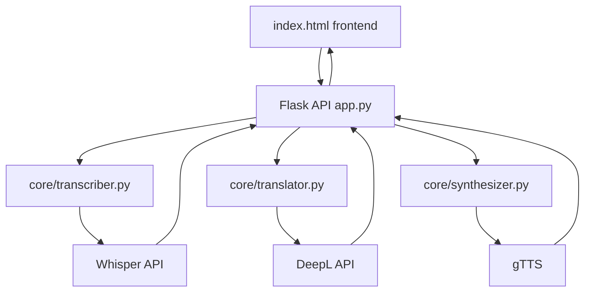

# Velo

Realtime voice translation for getting through daily life without a language barrier slowing you down.

## About this project

Velo is a proof of concept voice translation app designed to support live communication between English and German speakers.

The idea came from my own experience of moving to Germany and noticing how often language barriers appear in daily life. Calling the doctor, speaking with landlords, attending university events or joining meetings can become stressful when the conversation switches languages or when one person is not fluent.

The goal of Velo is to reduce that friction. In the intended version, one person can speak in English and the other person hears German, and the same flow also works from German back into English. The translation should happen as close to real time as possible.

This repository was created for my Technical Documentation module. It is not a finished or production ready application. It should be understood as a documented technical prototype. The architecture is planned, the API flow is designed and the main components are scaffolded.

## Intended audience

This README is written for a technical audience. The main readers are developers, students or instructors who want to understand how the project is structured and how it could be extended.

The reader is expected to have basic familiarity with Python, REST APIs, local development environments and simple frontend and backend structure.

No prior experience with Whisper, DeepL, or text to speech tools is required.

## Documentation included

This repository currently includes the following documentation:

`README.md`

The main project documentation. It explains the project idea, intended audience, setup steps, architecture, current status and future development plans.

`.env.example`

This file shows which environment variables are expected for local development without exposing private API keys.

`requirements.txt`

This file lists the Python dependencies needed for the project.

## Problem statement

Language barriers are not only a problem in formal translation settings. They also appear in normal situations where people need quick and clear communication.

Examples include booking medical appointments, speaking with landlords or service providers, attending university seminars, joining meetings in multilingual environments and handling video calls in a second language.

Existing translation tools are useful, but they often require manual input, copy pasting or switching between apps. Velo explores how these steps could be combined into one voice based translation flow.

## How it works

The planned pipeline follows this structure:


The pipeline is intended to work in both directions.

English to German

German to English

At this stage, the project focuses on the architecture and documentation of the flow rather than a fully working real time implementation.

## System architecture

Velo is structured as a small Flask application with separate modules for each part of the translation pipeline.



This modular structure makes the project easier to understand and extend. Each part of the pipeline has a separate responsibility.

`transcriber.py` handles speech to text.

`translator.py` handles translation.

`synthesizer.py` handles text to speech.

`app.py` connects the modules through Flask routes.

`index.html` provides the prototype interface.

A more detailed explanation can be added in `docs/architecture.md`.

## Tech stack

### Backend

Python and Flask

Flask was chosen because it is lightweight and simple to set up. For this stage of the project, a small backend is more useful than a larger framework.

### Speech to text

OpenAI Whisper

Whisper is planned for converting spoken audio into written text. It was selected because it is commonly used for speech recognition and can handle natural speech well.

### Translation

DeepL

DeepL is planned for translating between English and German. I chose it because its German and English translations often sound more natural than basic machine translation tools.

### Text to speech

gTTS

gTTS is planned for converting translated text back into spoken audio. It is not the most natural sounding option, but it is simple and good enough for a proof of concept.

### Frontend

HTML, CSS and JavaScript

A simple frontend was chosen because the current prototype does not need a build step or a larger frontend framework.

## Project structure

```text
├── app.py              # Flask app and API routes
├── core/
│   ├── transcriber.py  # Speech to text logic
│   ├── translator.py   # Translation logic
│   └── synthesizer.py  # Text to speech logic
├── docs/
│   ├── architecture.md # Conceptual system documentation
│   └── api.md          # API documentation
├── index.html          # Landing page and prototype UI
├── requirements.txt    # Python dependencies
├── .env.example        # Example environment variables
├── CONTRIBUTING.md     # Contributor guide
└── README.md           # Main project documentation
```

Each core module contains TODO comments showing what still needs to be connected. This makes the current state of the project clearer and helps future contributors understand what is planned.

## Getting started

### 1. Clone the repository

```bash
git clone https://github.com/rxchtsg/Velo.git
cd Velo
```

### 2. Create and activate a virtual environment

```bash
python -m venv venv
source venv/bin/activate
```

On Windows:

```bash
venv\Scripts\activate
```

### 3. Install dependencies

```bash
pip install -r requirements.txt
```

### 4. Create your environment file

```bash
cp .env.example .env
```

Add the required API keys inside `.env`.

```text
OPENAI_API_KEY=your_openai_key_here
DEEPL_API_KEY=your_deepl_key_here
```

### 5. Run the app

```bash
python app.py
```

Open the app in your browser.

```text
http://localhost:5000
```

## Hello world example

Once the Flask server is running, opening `http://localhost:5000` should display the Velo landing page.

The planned API endpoint for translation is:

```http
POST /api/translate
```

Example expected response:

```json
{
  "transcript": "Good morning, do you have an appointment next week?",
  "translation": "Guten Morgen, haben Sie nächste Woche einen Termin?",
  "audio_url": "/static/output/translated-audio.mp3"
}
```

More endpoint details can be added in `docs/api.md`.

## API overview

The main planned backend route is:

```http
POST /api/translate
```

Expected input:

`audio`

Audio file containing the spoken input.

`source`

Source language code. Defaults to `en`.

`target`

Target language code. Defaults to `de`.

Expected output:

```json
{
  "transcript": "Original spoken text",
  "translation": "Translated text",
  "audio_url": "Path to translated audio output"
}
```

Example language pairs:

`en to de`

English to German

`de to en`

German to English

## Current status

### Completed

Project concept defined.

Technical architecture planned.

Flask app structure created.

Core modules scaffolded.

README documentation written.

Landing page created.

Supported language pairs defined.

### Not yet implemented

Full Whisper API connection.

Full DeepL API connection.

Full gTTS audio generation.

Microphone recording in the browser.

Real time streaming.

WebSocket support.

Real phone call integration.

## Limitations

This project is currently a proof of concept, so there are several limitations.

The biggest limitation is latency. A real conversation would require very fast processing but the current design still depends on a request and response cycle. This means the user may need to wait for audio to be recorded, transcribed, translated and converted back into speech.

Another limitation is the use of gTTS. It works for a demo, but the voice quality is robotic and not ideal for natural conversations.

The current project also does not yet handle noisy environments, overlapping speakers, interruptions, or privacy and security requirements for real medical or legal conversations.

## Future improvements

The next version of Velo could include WebSocket support for lower latency, microphone capture using the Web Audio API, Whisper streaming instead of waiting for full audio clips, better text to speech using a more natural voice model, Twilio integration for real phone calls, more language pairs, clearer error handling in the interface, and saved transcripts for users who want a written record.

## Documentation approach

A README was the most appropriate starting point for this stage of the project because Velo is still a proof of concept. The README gives enough context for a reader to understand the purpose of the project, the technical structure, the setup process, and the current limitations.

Because this project is being submitted for a Technical Documentation module, I also planned supporting documentation such as API documentation, conceptual architecture documentation and a contributor guide. This better reflects how documentation works in a real software project, where different readers need different types of information.

Writing the documentation early also helped clarify the project itself. By documenting the architecture before the full implementation was complete, it became easier to identify missing parts of the system and define what still needs to be built.

## Contributing

This is a student proof of concept project, but the repository can be extended by future contributors.

Suggested contribution areas include connecting the Whisper API, connecting the DeepL API, implementing gTTS audio output, adding microphone recording in the browser, improving error handling, adding WebSocket support and improving documentation with screenshots or examples.

When contributing, please keep functions small and readable, add comments where the logic is not obvious, update the README or docs if the setup or behaviour changes, keep API keys out of the repository, use clear commit messages, and avoid adding unnecessary dependencies.

## Why Velo?

The name Velo comes from the idea of speed. Since the goal of the project is to make translated conversation feel as fast and natural as possible, the name felt appropriate for the concept.

## AI usage statement

Langdock was used to help make my original README draft more coherent, structured, and easier to follow. It also supported me while creating the current project skeleton, including parts of the boilerplate code, file structure and early documentation. The project idea, technical direction and final decisions are my own. I used Langdock as a support tool for drafting and organisation, not as a replacement for understanding the project.

## License

MIT
