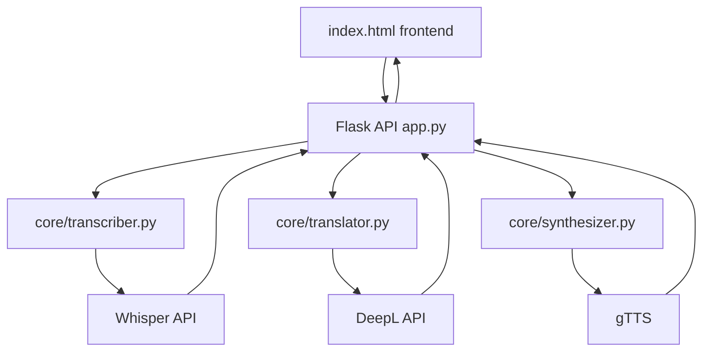

# Velo — Architecture and Design Notes

This document goes into more detail than the README about why I structured Velo the way I did. The README explains what the system does. This is more about the reasoning behind the decisions, and what I would think about differently if I kept building it out.

## What I was actually trying to solve

The whole point of Velo is speed. Someone talks in one language, the other person hears it in theirs, and the gap in between should feel as small as possible. That single goal is basically what drove every structural decision below. I tried to keep the system simple enough that I could still explain every part of it, rather than reaching for something more impressive that I could not fully justify.

## Why I split it into three separate modules

I broke the translation flow into three pieces: transcription, translation, and text to speech. Each one gets its own file in `core/`.

The reason is fairly practical. Each stage depends on a different external service (Whisper, DeepL, gTTS), and I already know at least one of those is going to change. gTTS is only in there because it is free and does not need an API key. The README already says the voice quality is not good enough for a real conversation, so at some point I would want to swap it for something like ElevenLabs. If all three stages lived in one file, replacing gTTS would mean digging through code that has nothing to do with gTTS to find the right spot. Keeping them separate means I can rewrite `synthesizer.py` on its own without touching the other two.

## Why I went with Flask and a single API route

I did not need anything more complicated than one request in, one response out, so I did not reach for a bigger framework. Flask was the simplest option that could handle this.

I also made a deliberate choice to expose only one endpoint, `POST /api/translate`, instead of separate endpoints for transcribe, translate, and synthesize. From the frontend's point of view, it should not matter that there are three steps happening behind the scenes. It just sends audio and gets back a transcript, a translation, and a link to the audio. I think this is the right call because it means I can change how the pipeline works internally later without having to change how the frontend talks to it.

## How data moves through the system

The frontend never calls Whisper, DeepL, or gTTS directly. Everything goes through the Flask app first. This was also a security consideration, since it means API keys stay on the server and are never sent to the browser.

## Why it is still scaffolded and not fully working

Right now, each function in `core/` raises `NotImplementedError`, with the real API call written out just above it as a comment. I want to be upfront about why. This module is about documenting a system I designed, not about shipping a finished product in the time I had. Leaving the real code commented out, rather than deleting it, means anyone reading the project can see exactly what the finished version is meant to do, without needing a working API key just to look at the code.

## Things I know are limitations, not bugs

A few things about the current design that I would need to actually rethink, not just finish coding:

- **Latency.** Right now everything is one request, one response. A real conversation needs continuous streaming, which means at some point this would need to move to WebSockets instead of a normal POST request. That is a different kind of API, not just a faster version of this one.
- **No memory between requests.** Each call to `/api/translate` is completely independent. It does not know who is speaking or which direction the conversation is going. A real version of this for meetings would need to track that.
- **Only English and German.** `LANGUAGE_MAP` and `SUPPORTED_PAIRS` are hardcoded to just these two languages. Adding a third language would not break the architecture, but it is not built in yet. I scoped it down on purpose to keep the proof of concept manageable.

## Other docs

- Setup instructions: [`docs/tutorial.md`](./tutorial.md)
- How to contribute: [`CONTRIBUTING.md`](../CONTRIBUTING.md)
- API request and response shape: see "API overview" in the README
